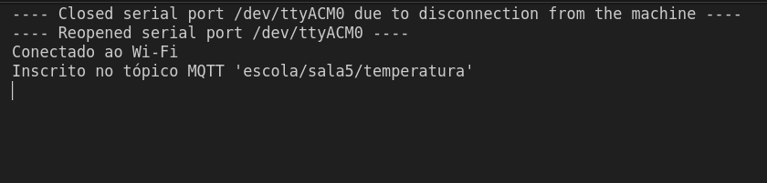
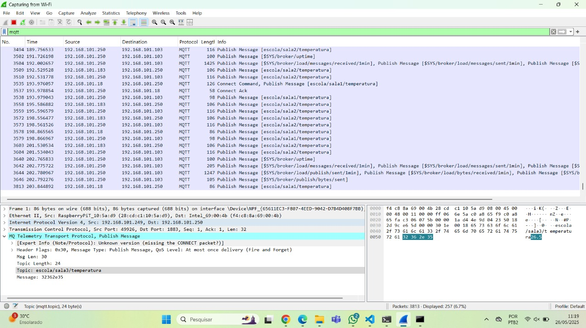
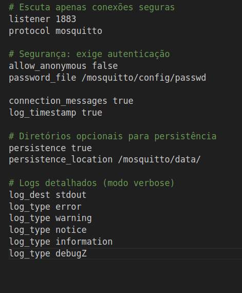
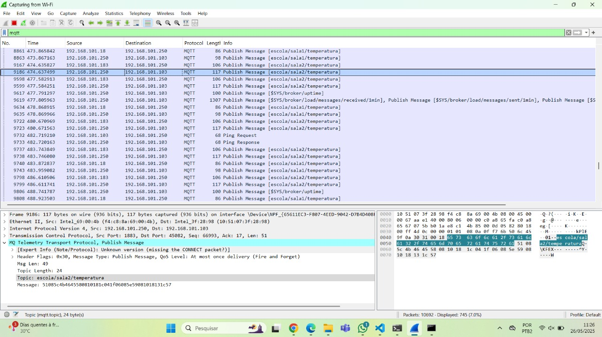
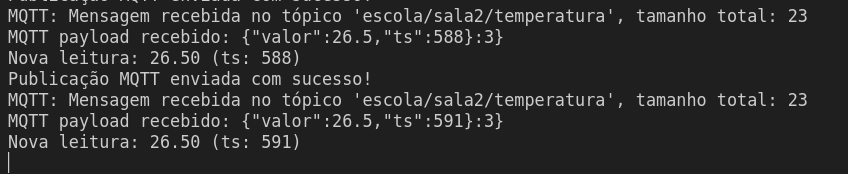

# Tarefa: IoT Security Lab - EmbarcaTech 2025

Autor: **Leonardo Takehana, Gabriel Miranda, Pedro Henrique Avelar**

Curso: Residência Tecnológica em Sistemas Embarcados

Instituição: EmbarcaTech - HBr

Brasília, Junho de 2025

---

# BitDogLab Pico W + MQTT

Este projeto demonstra como conectar o Raspberry Pi Pico W à internet via Wi-Fi e enviar dados para um **broker MQTT**. O projeto evolui em 5 etapas, com foco em conectividade, comunicação segura e compactação de dados em dispositivos embarcados.

> ✅ **Status:** Finalizado e testado com sucesso em bancada real  
> 🎯 **Objetivo:** Comunicação segura e eficiente usando MQTT com autenticação e ofuscação

## Etapas Implementadas

### ✅ Etapa 1: Conexão Wi-Fi

- Inicialização do chip CYW43.
- Conexão à rede Wi-Fi usando SSID e senha.
- Indicação de sucesso ou falha via `printf`.

### ✅ Etapa 2: Setup MQTT básico

- Uso da pilha `lwIP` com suporte a MQTT.
- Conexão com o broker MQTT via IP.
- Sem autenticação
- Callbacks de conexão e publicação.
- Configuração de publisher e subscriber para envio de dados

### ✅ Etapa 3: Publicação MQTT sem segurança

- Publicação de dados simples (ex: temperatura).
- Verificação do envio usando Wireshark.
- Broker local com `mosquitto` em modo aberto (sem autenticação).

### ✅ Etapa 4: Autenticação no Mosquitto

- Configuração do broker com `password_file` e `allow_anonymous false`.
- Criação de credenciais com `mosquitto_passwd`.
- Modificação do código para incluir usuário e senha na conexão MQTT.

### ✅ Etapa 5: Ofuscação com XOR (criptografia leve)

- Implementação de função XOR para ofuscar e desofuscar dados.
- Objetivo: evitar leitura fácil do payload em sniffers.
- Cifra aplicada antes da publicação no tópico MQTT.

### ✅ Etapa 6: Proteção contra replay

- Inclusão de timestamp no payload JSON enviado pelo publisher.  
- Subscriber valida se o timestamp da mensagem recebida é mais recente que o último processado.  
- Mensagens com timestamp igual ou inferior ao último são descartadas para evitar replay.  

---
### 🏁 Etapa final: Relato e análise

- Discutir os seguintes pontos:

  - **Quais técnicas apresentadas são escaláveis?**

    As técnicas escaláveis aplicadas no projeto incluem:

    - **Conexão Wi-Fi e MQTT:** A utilização do protocolo MQTT, que é leve e baseado em publicação/assinatura, facilita a conexão e comunicação entre muitos dispositivos (BitDogLabs) sem sobrecarregar a rede ou o broker.
    
    - **Autenticação no broker MQTT:** A autenticação por senha garante a segurança sem comprometer a escalabilidade, pois o Mosquitto suporta milhares de conexões simultâneas com autenticação.
    
    - **Ofuscação com XOR:** Uma técnica simples e leve que pode ser aplicada em todos os dispositivos para proteger os dados no trânsito, sem impactar o desempenho, apesar de ser preferível utilizar soluções mais robustas como AES ou SHA256.
    
    - **Proteção contra replay com timestamp:** Essa validação é local no subscriber e não exige comunicação extra, sendo escalável para qualquer número de dispositivos, pois impede processamento de dados repetidos ou antigos.

  - **Como aplicá-las com várias BitDogLab em uma rede escolar?**

    Para aplicar essas técnicas em uma rede escolar com várias BitDogLab:

    - Cada dispositivo BitDogLab deve conectar-se à rede Wi-Fi da escola com credenciais válidas, garantindo acesso confiável à internet ou à rede local.

    - O broker MQTT pode ser hospedado em um servidor local ou na nuvem acessível pela rede escolar, configurado com autenticação para controlar os dispositivos autorizados.

    - Cada BitDogLab publica seus dados em tópicos MQTT exclusivos ou hierarquizados (ex: `escola/sala1/temperatura`, `escola/sala2/umidade`), facilitando a organização e o monitoramento dos dados por sala ou laboratório.

    - A ofuscação com XOR e a proteção contra replay devem ser implementadas em todos os dispositivos e nos subscribers que consomem os dados, garantindo integridade, segurança básica e prevenção contra ataques simples.

    - Para garantir escalabilidade, recomenda-se monitorar o desempenho do broker MQTT e ajustar parâmetros conforme o número de dispositivos aumenta, além de implementar backups e políticas de retenção dos dados.

---

## 📜 Licença
GNU GPL-3.0.
